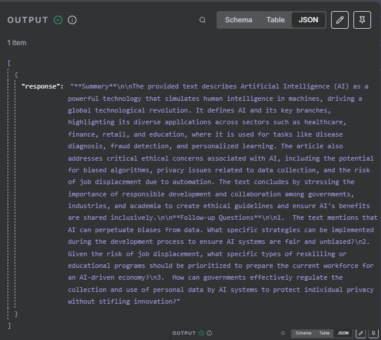

# CrewAI_Custom_AI_Agent

FastAPI-based backend with LLMs (Gemini) and integrating with n8n webhooks.

## Project Structure
```
backend/
  fastapi_backend/
    main.py             # Main FastAPI endpoint
    ui.py               # Main Streamlit app entry point
  crewai_backend/
    agents.py           # Main CrewAI agents
    config.py           # Configuration settings
    crew.py             # Main process to kickoff the crew
    tasks.py            # Main used tasks
    tools.py            # Main used tools
data/                   # Contains the uploaded files  
.env.example            # An example of all the secret keys used in this app.
requirements.txt        # Python dependencies
CrewAI_Workflow.json    # n8n workflow file in JSON
```


## Getting Started

### Prerequisites
- Python 3.12+
- Required Python packages (see `requirements.txt`)
- [Gemini API Key](https://aistudio.google.com/u/0/apikey)
- The `gemini-2.5-pro` model is used, or chose any other model from [Gemini Models](https://ai.google.dev/gemini-api/docs/models)
    - If you choose another model, you must change the model ID in the `backend\crewai_backend\config.py` file.

- [n8n](https://n8n.io/) running locally (default port: `5678`)

---

### Installation
1. Clone the repository:
   ```powershell
   git clone https://github.com/iMoHd8/CrewAI_Custom_AI_Agent.git
   cd CrewAI_Custom_AI_Agent
   ```

2. Install dependencies:
   ```powershell
   pip install -r requirements.txt
   ```

3. Add your configuration:
   - Create new file named `.env`
   - Copy the variables that are in `.env.example` file
   - Paste them in the new `.env` file
   - Add your configurations (API Key)
    
4. Start n8n locally: (Make sure [Node.js](https://nodejs.org/en/download) is installed on your local machine)
    ```powershell
    npx n8n
    ```
    - This will run n8n locally at http://localhost:5678
    - From n8n dashboard:
        - Create Workflow
        - From the workflow option, select `import from File...`
        - Select the `CrewAI_Workflow.json` file
        - Activate the workflow by turning on the Activate toggle button.


5. Start the FastAPI Backend
   from new terminal, run the following command:
    ```powershell
    uvicorn backend.fastapi_backend.main:app --reload
    ```
    - This will run FastAPI locally at http://localhost:8000
        - or visit http://localhost:8000/docs for the Swagger UI
    

### Running the Application
### Option 1:
You can run the application using the command line or any terminal:

To run the workflow in production, open new terminal, and run the following command:
```powershell
curl.exe -X POST -H "Content-Type: application/json" -d '{\"doc_path\": \"data/AI_Article.docx\"}' http://localhost:5678/webhook/get_crew
```
- change the document path: {\"doc_path\": \"Add_the_file_path_here\"}

or run the workflow in test mode:
- click on `Execute workflow` from the n8n workflow dashboard

-  ```powershell
    curl.exe -X POST -H "Content-Type: application/json" -d '{\"doc_path\": \"data/AI_Article.docx\"}' http://localhost:5678/webhook-test/get_crew
 - change the document path: {\"doc_path\": \"Add_the_file_path_here\"}   ```

- n8n Output example:

   


### Option 2
You can run the application using Streamlit UI:
1. Open new terminal (Make sure the FastAPI is running)
2. Start the Streamlit app:
   ```powershell
   streamlit run backend/fastapi_backend/ui.py
   ```

2. Upload your file, and wait for the summary and the follow-up questions...


## Customization
- Modify `config.py` to adjust the gemini model id.
- Add `.env` file and add to it the same variables that are in `.env.example` file


## Troubleshooting
- Connection Errors: Make sure Gemini API Key is correct and the FastAPI server is running and accessible.
